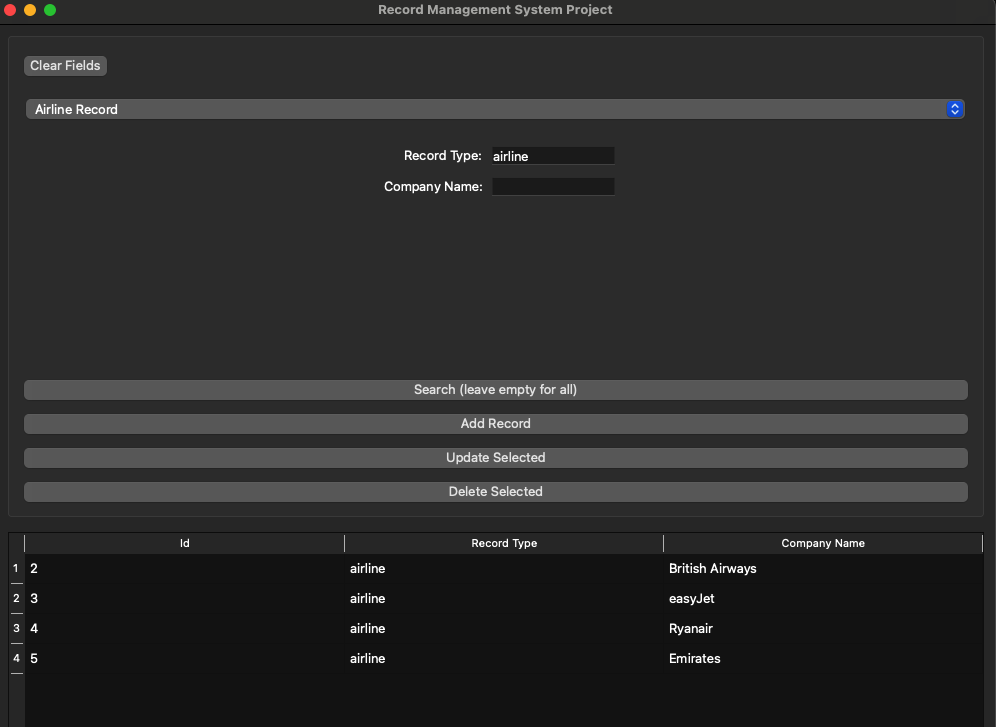

## Record Management System (PyQt Desktop App)

A lightweight, robust PyQt/PySide desktop application for managing Client, Airline, and Flight records with dynamic UI updates, type-mapped data processing, and integrated search capabilities.

---

## Core Architecture & Features

- **Dynamic Form & Table Synchronisation:** Switches form inputs, table columns, and search contexts automatically based on the selected record type (Client, Airline, Flight).
- **Type-Mapped Data Engine:** Built on top of a dynamic `type_map` dictionary driving custom `Dataclass` schema inspection (`fields()`) and enum-aware data serialisation.
- **Dual Model Support:** Seamlessly handles both `dict` models and instantiated `Dataclass` records inside the memory storage collectors.
- **Smart Search & State Filtering:** Dynamic search action labeling that transitions between scope modes (e.g., `"Search All Client Records"` vs. `"Search Client Address"`).
- **Form State Management:** Integrated reset routine (`clear_fields`) that resets inputs and date pickers while strictly preserving active tab states (`record_type`).

---

## Prerequisites

- **Python:** 3.13+
-- **PIP:** 25.1+
- **GUI Framework:** PyQt6
- **Data Models:** Standard library `dataclasses` & `enum`

---

## Installation & Setup

1. **Clone the repository:**
   ```bash
   git clone [https://github.com/domjina/end-of-module-assessment.git](https://github.com/domjina/end-of-module-assessment.git)
   cd end-of-module-assessment
   ```
2. **Install python package requirements:**
    ```bash
    pip install -r requirements.txt
3. **Launching the Graphical User Interface (GUI):**
    ```bash
    python -m src.main

